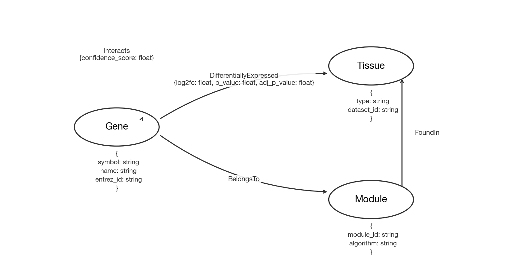

# Projeto `Análise de Redes de Melanoma, Carcinoma e Tecido Saudável por Meio de Redes de Expressão Diferencial e Interação Proteica.`
# Project `Analysis of Melanoma, Carcinoma, and Healthy Tissue Networks Through Differential Expression Networks and Protein Interaction.`

# Descrição Resumida do Projeto

> Este projeto visa comparar redes de interação gênica derivadas de amostras de melanoma, carcinoma e tecido saudável. Serão analisadas as diferenças na topologia da rede, nos genes centrais e nos módulos biológicos, com objetivo de observar padrões específicos da doença e mecanismos compartilhados, fornecendo informações sobre a biologia tumoral e potenciais biomarcadores.

# Slides

[Slides P1](https://docs.google.com/presentation/d/1Wa21J_w7CIT62xtVCvaYQdo1LmQk3-bqbujdAck-rXY/edit?usp=sharing)

# Fundamentação Teórica

> Fundamentação teórica resumida do problema em saúde/biologia. Apenas cite artigos que tomará como base e, em uma frase, em que problema.

# Perguntas de Pesquisa

> Como as redes gênicas diferem entre melanoma, carcinoma e tecido saudável?

> Quais genes são exclusivamente centrais em cada tipo de câncer?

> Existem vias moleculares compartilhadas entre melanoma e carcinoma?

> Quais interações são adquiridas ou perdidas em cada tipo de câncer?

> Podemos identificar módulos (clusters) específicos para cada tipo de câncer?

# Bases de Dados

> Elencar bases de dados candidatas a serem utilizadas no projeto na forma de tabela:

> Base de Dados | Endereço na Web | Resumo descritivo
> ----- | ----- | -----
> Expression profiling reveals novel pathways in the transformation of melanocytes to melanomas.| [GSE4570](https://www.ncbi.nlm.nih.gov/geo/geo2r/?acc=GSE4570) | Este conjunto de dados (GSE4570) contém perfis de expressão gênica que analisam a transformação de melanócitos normais em células de melanoma primário e metastático em humanos. O estudo identifica vias moleculares e novos alvos genéticos que auxiliam na compreensão da progressão da doença, diagnóstico e possíveis terapias para o câncer de pele.
> Novel Molecular Markers for non-melanoma skin cancer | [GEO2503](https://www.ncbi.nlm.nih.gov/geo/query/acc.cgi?acc=GSE2503) | Este conjunto de dados (GSE2503) apresenta perfis de expressão gênica que comparam a pele normal, a queratose actínica e o carcinoma de células escamosas em humanos. O estudo identifica marcadores moleculares e genes diferencialmente expressos que caracterizam a progressão do câncer de pele não melanoma.
> Gene Signature for Aggression of Melanoma Metastases - Melanoma Metastasis | [GEO8401](https://www.ncbi.nlm.nih.gov/geo/query/acc.cgi?acc=GSE8401) | Este conjunto de dados (GSE8401) identifica uma assinatura genética de agressividade em metástases de melanoma humano através de modelos de xenotransplante. O estudo destaca genes que codificam proteínas de membrana e secretadas, correlacionando a interação entre o tumor e o microambiente com a progressão da doença.
> Gene Expression Patterns Involved in the Malignant Transformation and Progression of Metastatic Melanoma | [GEO7553](https://www.ncbi.nlm.nih.gov/geo/query/acc.cgi?acc=GSE7553) | Este conjunto de dados (GSE7553) investiga os padrões de expressão gênica envolvidos na transformação maligna e na progressão do melanoma metastático. Através da comparação de diversos tumores cutâneos, o estudo busca identificar assinaturas moleculares que permitam distinguir tumores metastáticos de lesões não metastáticas.
> Key differences identified between actinic keratosis and cutaneous squamous cell carcinoma by transcriptome profiling | [GEO45213](https://www.ncbi.nlm.nih.gov/geo/query/acc.cgi?acc=GSE45216) | Este conjunto de dados (GSE45216) analisa o perfil transcricional para identificar as principais diferenças moleculares entre a queratose actínica e o carcinoma de células escamosas cutâneo invasivo. O estudo destaca o papel central da via MAPK na transição dessas lesões precursoras para o câncer, sugerindo novos alvos terapêuticos.

# Modelo Lógico

> Modelo lógico da base de grafos que será construída. Para o modelo de grafos de propriedades, utilize este
> [modelo de base](https://docs.google.com/presentation/d/10RN7bDKUka_Ro2_41WyEE76Wxm4AioiJOrsh6BRY3Kk/edit?usp=sharing) para construir o seu.
> Coloque a imagem do PNG do seu modelo lógico como ilustrado abaixo (a imagem estará na pasta `image`):
>
> 

# Metodologia

1. Obtenção de datasets por meio do Gene Expression Omnibus (GEO):
  - Saudável
  - Melanoma
  - Carcinoma

2. Obtenção de expressão diferencial:
  - Saudável vs Melanoma
  - Saudável vs Carcinoma
  - Melanoma vs Carcinoma
3. Consulta do database STRING:
  - Interações entre proteínas
  - Scores de confiança
  - Análise no Cytoscape
  - Eigenvector centrality (CytoNCA)
  - Degree e clustering coefficient (NetworkAnalyzer)
  - Clusterização (clusterMaker2/MCODE)
  - Comparação entre redes
  - Identificação de genes ganhos/perdidos (saudável vs não saudável)
  - Identificação de genes centrais e arestas exclusivas
  - Métricas (degree, betweenness centrality e closeness centrality)
  - Identificação de semelhanças entre melanoma e saudável

# Ferramentas

> Ferramentas a serem utilizadas (com base na visão atual do grupo sobre o projeto).

- Gene Expression Omnibus (GEO)
- Excel/Python
- STRING
- Cytoscape
- CytoNCA
- NetworkAnalyzer
- MCODE
- clusterMaker2

# Referências Bibliográficas

> Lista de artigos, links e referências bibliográficas.
>
> Fiquem à vontade para escolher o padrão de referenciamento preferido pelo grupo.
