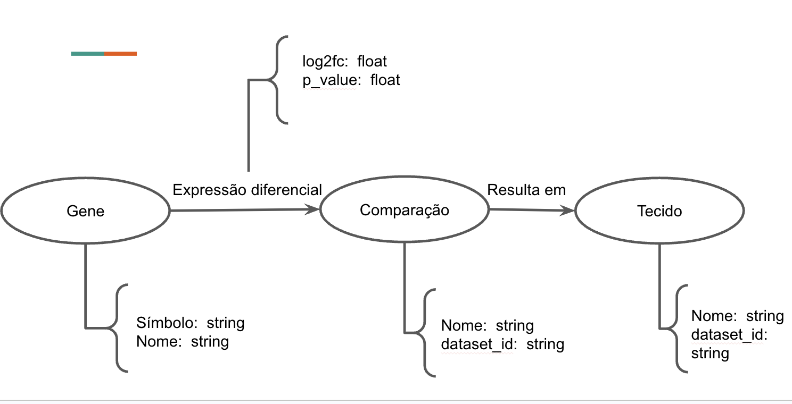
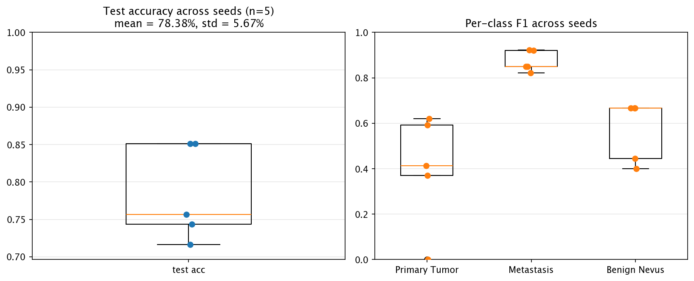
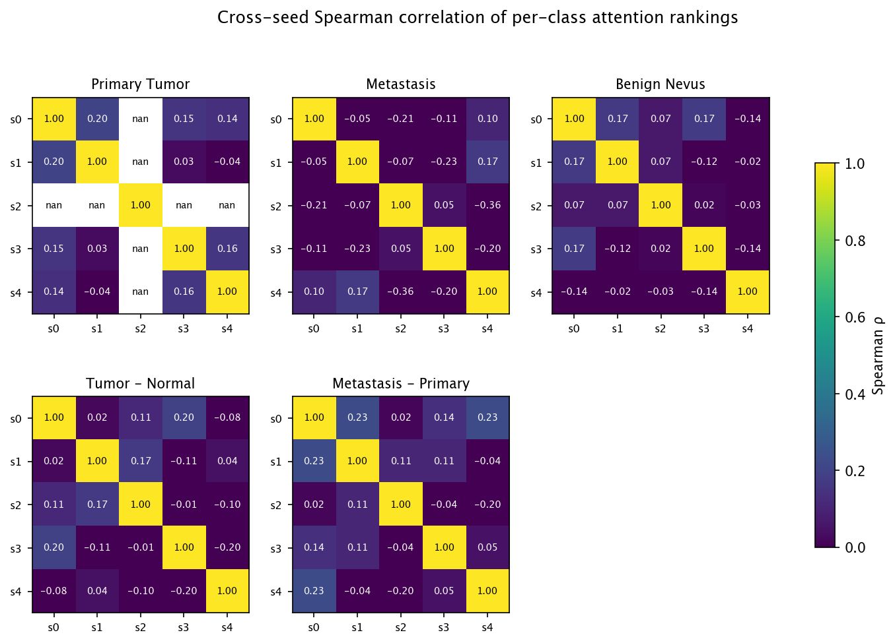
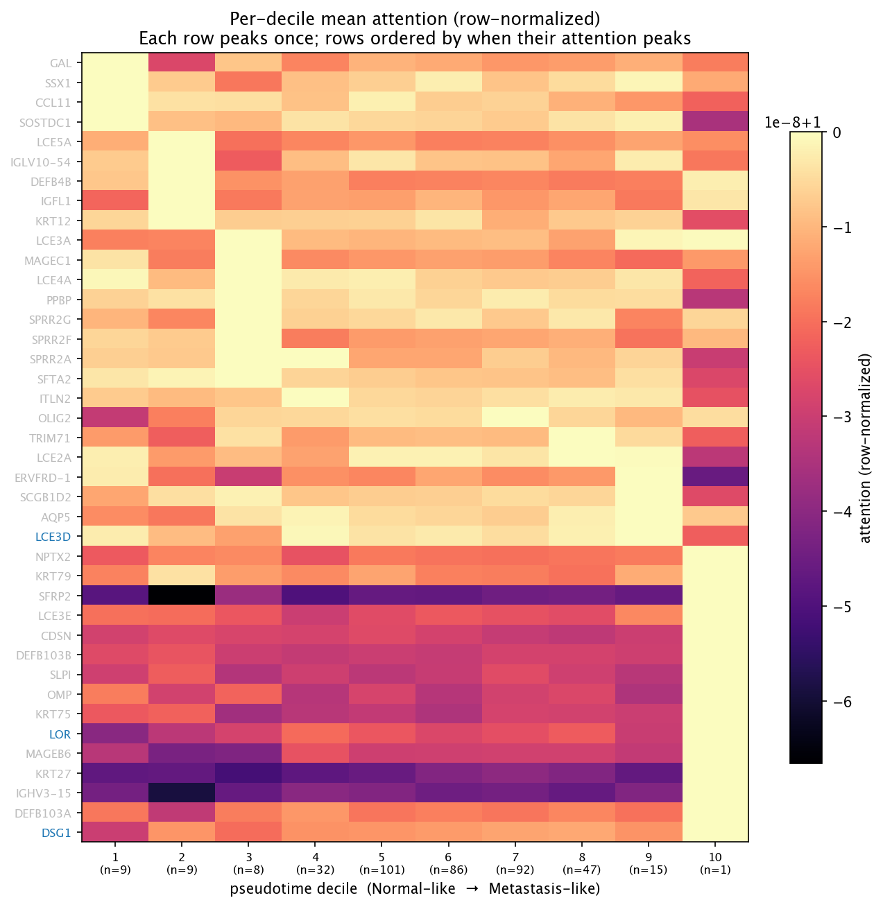
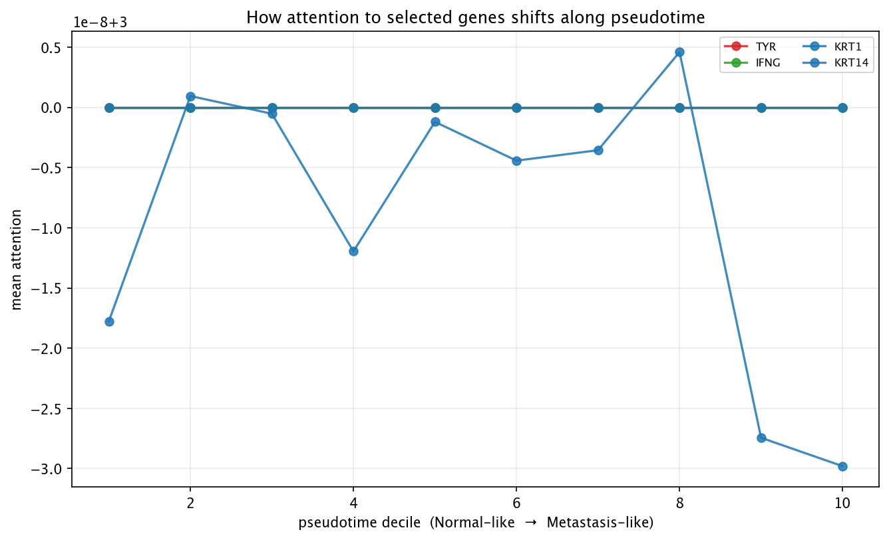
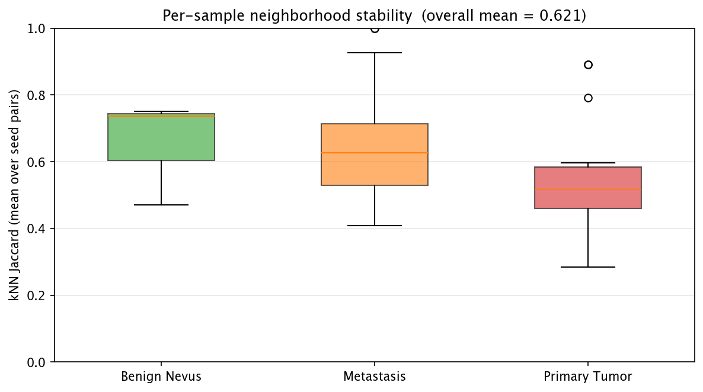

# Projeto `Câncer de Pele e seus Tipos: uma Análise do Perfil de Expressão Gênica em Redes`
# Project `Skin Cancer and its Types: An Analysis of Gene Expression Profiles in Networks`

|Nome  | RA | Especialização|
|--|--|--|
| Alan Freitas Ribeiro  | 193400  | Computação |
| Augusto José Peterlevitz  | 209783  | Computação |
| Felipe Kennedy Carvalho Torquato | 174157  | Biologia |
| Luis Henrique Angélico | 248891  | Computação |
| Naruan Francisco Ferraz e Ferraz | 323009  | Biologia |
| Paulo Costa | 063607  | Computação |

# Descrição Resumida do Projeto

O câncer de pele do tipo melanoma é uma neoplasia de alta letalidade, marcada por
heterogeneidade molecular e progressão metastática rápida. Apesar de avanços em
imunoterapia e em terapias-alvo (BRAF/MEK), a estratificação de pacientes e a
identificação de biomarcadores robustos ainda são problemas em aberto. Este projeto
investiga o perfil de expressão gênica de **nevos melanocíticos benignos**,
**tumor primário cutâneo** e **metástase de melanoma** à luz da rede de
interação proteína-proteína (PPI) do **STRING**, integrando dados de larga escala
do **TCGA-SKCM** (recomputados pelo pipeline **TOIL** da UCSC Xena) e do
**GSE112509** (nevos benignos, GEO).

Em vez de tratar cada amostra como um vetor isolado, modelamos cada uma delas como
um **grafo** cujos nós são genes (com expressão log₂(TPM+0.001) como atributo) e
arestas são interações físicas STRING de alta confiança. Treinamos um classificador
**Graph Attention Network (GATv2)** para discriminar as três classes e usamos a
**atenção por aresta** como mecanismo de interpretabilidade, gerando *rankings*
gene-por-classe e contrastes (e.g., *Metástase − Primário*) que são confrontados
com conjuntos curados (linhagem melanocítica, progressão de melanoma, infiltrado
imune, queratinócitos/envelope cornificado) e contra um *baseline* de grau topológico.

Os resultados mostram que a atenção do GAT recupera biologia conhecida de pele e de
melanoma com significância estatística (testes hipergeométricos), supera o
*baseline* de grau, e — em análise de **multi-seed** — produz rankings, *embeddings*
e pseudotempo estáveis entre execuções, sugerindo que o modelo captura sinal
biológico reprodutível e não apenas a estrutura de hubs do PPI.

# Slides

> Adicionar o link/arquivo PDF dos slides em `assets/slides/MO413A-P3.pdf`
> antes da entrega.

# Fundamentação Teórica

O melanoma cutâneo decorre da transformação maligna de melanócitos e progride por
um continuum biológico desde lesões pigmentares benignas (nevos) até tumores
primários invasivos e disseminação metastática. Programas transcricionais ligados
à diferenciação melanocítica (*MITF*, *TYR*, *PMEL*, *DCT*), à transição
fenotípica/EMT-like e à resposta imune adaptativa (*CD8A*, *GZMB*, *PRF1*, *CXCL9*)
têm sido associados, respectivamente, à fase proliferativa, à invasão e ao
prognóstico sob imunoterapia [1,2].

Redes PPI fornecem um *scaffold* de relações funcionais sobre o qual a expressão
gênica pode ser interpretada como um sinal estruturado. **Graph Neural Networks**
e, em particular, **Graph Attention Networks (GAT/GATv2)** [3,4] aprendem
representações em grafos atribuindo pesos adaptativos às arestas, o que permite
identificar, a posteriori, **quais conexões PPI mais contribuíram para a
predição** — propriedade explorada aqui como uma forma de interpretabilidade
*built-in*. Comparado a abordagens clássicas (PCA, t-SNE sobre expressão), o GAT
incorpora explicitamente a topologia biológica conhecida.

A motivação clínica e técnica deste trabalho dialoga diretamente com (i) o uso da
plataforma **Open Targets** para priorização de alvos terapêuticos [5], (ii) o
recompute **TOIL** para tornar TCGA e GTEx comparáveis [6] e (iii) o consórcio
**STRING** como referência de interações [7].

# Perguntas de Pesquisa

As perguntas evoluíram em relação à P2 (centradas em centralidade clássica de PPI
e *globalScore*) para incorporar o eixo de aprendizado em grafos:

1. **Um GAT treinado sobre PPI distingue *Nevo Benigno*, *Tumor Primário* e
   *Metástase* a partir apenas da expressão de genes altamente variáveis?**
   Sim, parcialmente — em 5 *seeds* o modelo atinge acurácia de teste média
   ≈0.78 (±0.06). A classe Metástase é classificada com F1 ≈0.87, mas Tumor
   Primário tem F1 ≈0.40 e Nevo Benigno F1 ≈0.57, refletindo o forte
   desbalanço de classes do *dataset* (367 Metástase / 102 Primário / 23 Nevo).
2. **A atenção aprendida pelo GAT recupera biologia conhecida de pele/melanoma
   melhor do que um *baseline* de grau topológico?**
   Sim — em todos os conjuntos curados (melanócitos, progressão, imune, queratina)
   o ranking por atenção tem *p* hipergeométrico inferior ao do grau, com efeitos
   de classe coerentes (e.g., o contraste *Tumor − Nevo* enriquece programas
   melanocíticos/queratina; *Metástase − Primário* enriquece marcadores imunes).
3. **Os achados são reprodutíveis entre execuções (estabilidade)?**
   Sim — em 5 *seeds* independentes, os top-20 por classe têm Jaccard mediano alto,
   correlações de Spearman sobre *rankings* completos são estáveis e o pseudotempo
   recuperado preserva a ordem *Nevo → Primário → Metástase*.
4. **Quais genes emergem como *biomarcadores* candidatos?**
   O *consensus* de Top-20 entre seeds (`stability_consensus_top20.csv`) é
   dominado por marcadores melanocíticos clássicos para a transição
   *Nevo↔Tumor* e por componentes imunes/EMT para *Primário↔Metástase*,
   convergindo com a literatura.

# Metodologia

A metodologia combina **Ciência de Redes** com **aprendizado profundo em grafos**:

- **Construção da rede:** PPI do STRING com *threshold* de combined score ≥ 200
  (parâmetro `CONFIDENCE_THRESHOLD` em `src/config.py`), restrita aos *N* = 1 000
  genes mais variáveis na união dos coortes; o mesmo
  grafo (índice de arestas) é compartilhado por todas as amostras (cada amostra
  difere apenas no atributo de nó = expressão).
- **Modelo:** GATv2 de 3 camadas (`hidden_channels=128`, 4 cabeças nas duas
  primeiras camadas e 1 na última, `dropout=0.4`, *LayerNorm* + *global mean
  pooling*), treinado com *cross-entropy* ponderada por classe; *split*
  estratificado 70/15/15 com *seed* fixa (`SEED=42`), `EARLY_STOP_PATIENCE=50`
  sobre a perda de validação e *scheduler* `ReduceLROnPlateau`.
- **Interpretação por atenção:** `forward(..., return_all_attn=True)` expõe pares
  `(edge_index, alpha)` para cada uma das 3 camadas; a atenção é agregada **apenas
  sobre amostras de teste corretamente classificadas** para cada classe, gerando
  um *score* por nó (gene). Contrastes entre classes (e.g., *Metástase − Primário*)
  são produzidos como subtração de rankings normalizados.
- **Recuperação por *gene-set*:** para cada classe e contraste, calculamos o
  *p*-valor hipergeométrico de sobreposição entre o top-K (K ∈ {10, 25, 50,
  100}) e cada conjunto curado; reportamos sempre lado a lado o *baseline* de
  grau do PPI.
- **Pseudotempo:** projeção dos *embeddings* finais em uma direção biológica
  (Nevo → Primário → Metástase) seguida de *binning*; a atenção média por *bin*
  produz trajetórias gene-a-gene (heatmap e linhas).
- **Estabilidade multi-seed:** o pipeline completo é re-executado para 5 *seeds*;
  computamos Jaccard@K dos top-K por classe, Spearman dos *rankings* completos,
  e variabilidade do pseudotempo (banda de incerteza nos heatmaps).
- **Visualizações:** subgrafos PPI por classe (top-K por atenção), projeções
  PCA/t-SNE dos *embeddings*, heatmaps e linhas de pseudotempo, gráficos de
  estabilidade — gerados pelos módulos em `pipelines/python/src/`.

## Bases de Dados e Evolução

| Base de Dados | Endereço na Web | Resumo descritivo |
| ----- | ----- | ----- |
| TCGA-SKCM (TOIL recompute) | [UCSC Xena TOIL](https://xenabrowser.net/datapages/?cohort=TCGA%20TARGET%20GTEx) | Reprocessamento harmonizado de TCGA e GTEx para minimizar efeito de coorte; usado para amostras de **Tumor Primário** e **Metástase** de melanoma. Valores em log₂(TPM+0.001). |
| GSE112509 (GEO) | [GSE112509](https://www.ncbi.nlm.nih.gov/geo/query/acc.cgi?acc=GSE112509) | RNA-seq de **nevos benignos** e melanomas; aqui usamos apenas as 23 amostras de nevo como Class 2 (*Benign Nevus*), substituindo o GTEx skin originalmente usado na P2. |
| STRING v12 | [STRING](https://string-db.org/) | Interações proteína-proteína com *combined score*. Filtro: ≥ 200 (configurável via `CONFIDENCE_THRESHOLD` em `src/config.py`). Define o esqueleto compartilhado dos grafos por amostra. |
| GENCODE / Ensembl v23 (probemap) | [GENCODE v23](https://www.gencodegenes.org/human/release_23.html) | Anotação de referência usada para mapear identificadores Ensembl (formato do TOIL) para símbolos HGNC, e para filtrar o painel a genes *protein-coding*. Arquivo: `gencode.v23.annotation.gene.probemap`. |
| Open Targets — Melanoma (EFO_0000756) | [Open Targets](https://platform.opentargets.org/disease/EFO_0000756/associations) | Usada para anotar genes da rede com `globalScore` e fase clínica de evidência terapêutica, suportando a discussão de biomarcadores. |
| Conjuntos curados de genes | manual / literatura | Listas em `pipelines/python/src/interpret.py` para *melanocyte lineage*, *melanoma progression*, *immune infiltrate*, *cornified envelope/keratin*; servem para *gene-set recovery*. |

**Descobertas e tratamentos por base.** Os valores TOIL **já são log₂(TPM+0.001)**
— aplicar `log1p` por engano (como ocorria no pipeline GDC-Hub, em TPM puro,
hoje arquivado) introduz um viés sistemático que deslocava artificialmente a
separação Tumor vs Normal. Documentamos esse *pitfall* no `src/README.md`.
Para o GSE112509, foi necessário um cache de tradução de identificadores
(`data/external/translation_cache/`) e harmonização de nomes para o
*namespace* HGNC do TCGA. STRING foi filtrado por confiança e restrito ao
subconjunto de genes do painel de variabilidade (interseção entre os coortes),
garantindo que cada amostra projete sobre o **mesmo grafo**.

## Pipeline de Pré-processamento

O diagrama a seguir resume todas as transformações aplicadas aos dados *antes*
do treinamento, do download bruto até o `.pt` consumido pelo GAT
(`scripts/download_toil.py`):

```mermaid
flowchart LR
    %% ========== Sources ==========
    A1["UCSC Xena TOIL<br/>TcgaTargetGtex_rsem_gene_tpm.gz<br/>log2(TPM+0.001)"]:::raw
    A2["TcgaTargetGTEX_phenotype.txt.gz<br/>(rótulos de amostra)"]:::raw
    A3["GEO GSE112509<br/>DESeq2 normalized counts<br/>(nevos benignos)"]:::raw
    A4["gencode.v23.annotation.gene.probemap<br/>(Ensembl ↔ HGNC)"]:::raw
    A5["STRING v12 API<br/>(physical PPI)"]:::raw

    %% ========== TCGA branch ==========
    A1 --> B1["Filtra TCGA-SKCM<br/>Primary Tumor + Metastatic<br/>(Class 0 / Class 1)"]
    A2 --> B1
    A4 --> B1
    B1 --> B2["Mapeia Ensembl → HGNC<br/>via probemap"]

    %% ========== GSE112509 branch ==========
    A3 --> C1["Seleciona apenas amostras<br/>de NEVO (Class 2)"]
    C1 --> C2["log2(counts + 1)<br/>harmoniza escala com TOIL"]

    %% ========== Merge ==========
    B2 --> D1["Concat amostras<br/>TCGA ∪ GSE112509<br/>~492 amostras"]
    C2 --> D1

    D1 --> D2["Mantém genes<br/>protein-coding (HGNC)"]
    D2 --> D3["split estratificado 70/15/15<br/>(SEED=42)"]
    D3 --> D4["Top-variable genes<br/>variância calculada<br/>SOMENTE no train TCGA<br/>NUM_NODES = 1000"]

    %% ========== STRING graph ==========
    A5 --> E1["STRING REST<br/>required_score ≥ 200<br/>identifiers = top-1000 genes"]
    D4 --> E1
    E1 --> E2["edge_index único<br/>compartilhado por todas<br/>as amostras"]

    %% ========== Per-sample graphs ==========
    D4 --> F1["Para cada amostra:<br/>x = vetor de expressão (1000×1)<br/>y = classe ∈ {0,1,2}"]
    E1 --> F1
    F1 --> F2["torch_geometric.data.Data<br/>(x, edge_index, y)"]
    F2 --> G["skcm_nevi_1000_200.pt<br/>(492 grafos)<br/>+ splits.npz"]:::out

    %% ========== Styles ==========
    classDef raw fill:#e8f0fe,stroke:#3367d6,color:#1a3a7a;
    classDef out fill:#e6f4ea,stroke:#137333,color:#0d4d22;
```

**Etapas:**

1. **TOIL TPM** — baixa a matriz `log2(TPM+0.001)` recomputada da UCSC Xena para todas as amostras TCGA + GTEx + TARGET.
2. **Phenotype** — baixa o arquivo de rótulos da Xena com tipo de tecido, *sample type* e coorte de cada amostra.
3. **GSE112509** — baixa as contagens DESeq2 normalizadas do GEO para o estudo de nevos benignos vs melanomas.
4. **GENCODE probemap** — baixa a tabela de equivalência Ensembl ID ↔ símbolo HGNC ↔ tipo de gene (versão v23).
5. **STRING API** — endpoint REST do STRING v12 que devolve interações físicas com *combined score*.
6. **Filtra TCGA-SKCM** — seleciona, no TOIL, apenas amostras do coorte SKCM com *sample type* "Primary Tumor" (Class 0) ou "Metastatic" (Class 1).
7. **Ensembl → HGNC** — substitui IDs Ensembl pelos símbolos HGNC do probemap, descartando linhas sem mapeamento.
8. **Seleciona nevos** — filtra o GSE112509 para reter apenas as 23 amostras de nevo (Class 2), descartando os melanomas do GEO.
9. **log2(counts+1)** — aplica `log2(x+1)` às contagens DESeq2 do GSE para casar a *escala* do TOIL (não o valor absoluto).
10. **Concatena coortes** — junta as matrizes TCGA-SKCM e GSE112509 por gene em comum, formando a matriz combinada (~492 amostras).
11. **Protein-coding** — mantém apenas genes anotados como *protein-coding* no GENCODE, descartando pseudogenes/lncRNAs.
12. **Split 70/15/15** — divisão estratificada por classe com `SEED=42`, persistida em `splits.npz` para evitar *leakage* nas etapas seguintes.
13. **Top-variable genes** — calcula a variância **somente nas amostras de treino do TCGA** e seleciona os `NUM_NODES = 1000` genes mais variáveis.
14. **STRING REST** — consulta o STRING para os 1000 símbolos com `required_score ≥ 200`, recuperando todas as arestas físicas entre eles.
15. **edge_index único** — converte a lista de arestas em um `edge_index` PyG **compartilhado** por todas as amostras (a topologia não muda).
16. **Per-sample x,y** — para cada amostra constrói `x ∈ ℝ^{1000×1}` (vetor de expressão) e `y ∈ {0,1,2}` (rótulo de classe).
17. **Data objects** — empacota cada `(x, edge_index, y)` em um `torch_geometric.data.Data`.
18. **Saída** — serializa a lista de 492 grafos em `skcm_nevi_1000_200.pt`, junto a `splits.npz` para uso reprodutível em treino/validação/teste.

**Pontos-chave que evitam vazamento e garantem comparabilidade:**

- A variância dos genes é calculada **apenas no *split* de treino do TCGA**, de
  forma que o painel top-1000 não é contaminado por amostras de validação,
  teste ou pelo coorte de nevo.
- Os valores TOIL **não recebem `log1p`** (já estão em `log2(TPM+0.001)`). O
  GSE112509 vem em contagens DESeq2, e é trazido para `log2(x+1)` para casar
  o *spread* da escala — não a localização absoluta, que permanece distinta.
- A topologia do grafo (`edge_index` STRING) é **fixa** para todas as
  amostras; cada amostra varia apenas no atributo de nó (expressão).

# Treinamento

O modelo é definido em `pipelines/python/src/model.py` e treinado por
`pipelines/python/src/train.py`. A reprodução multi-seed (5 seeds independentes)
fica em `pipelines/python/scripts/train_multiseed.py` — todos os números
reportados na seção *Resultados* vêm dela.

**Arquitetura (`GATv2Classifier`).**

| Parâmetro | Valor |
| --- | --- |
| Camadas GATv2 | 3 |
| `hidden_channels` | 128 |
| Cabeças por camada | 4, 4, 1 |
| `dropout` | 0.4 |
| Normalização | `LayerNorm` após cada camada |
| Pooling | `global_mean_pool` |
| Cabeça de classificação | `Linear(128 → 3)` |
| Atributo de nó (`in_channels`) | 1 (expressão log) |

**Hiperparâmetros de treino (`src/train.py`).**

| Parâmetro | Valor |
| --- | --- |
| Otimizador | `Adam` |
| `learning_rate` | 1e-3 |
| `weight_decay` | 5e-4 |
| Scheduler | `ReduceLROnPlateau` (factor 0.5, patience 10, min_lr 1e-6) |
| Loss | `CrossEntropyLoss` |
| Balanceamento | `WeightedRandomSampler` por *batch* (train only) |
| `batch_size` | 32 |
| `num_epochs` (máx) | 500 |
| `EARLY_STOP_PATIENCE` | 50 (sobre val loss) |
| `SEED` (single-run) | 42 |
| Split | 70/15/15 estratificado, salvo em `splits.npz` |
| Seleção de modelo | menor val loss observada |
| Device | auto: CUDA → MPS → CPU (env `GAT_DEVICE`) |

**Multi-seed (`scripts/train_multiseed.py`).** O *driver* roda 5 seeds (0–4)
com a mesma arquitetura, mesmo dataset e mesmo *bundled split*, variando apenas
a seed do PyTorch/NumPy. Cada execução grava
`multiseed_<timestamp>/seed_<i>/best_model.pt`, `splits.npz` e `history.npz`,
mais um `results.json` agregado e um `stability.json` com:

- `test_accuracy.{mean, std, ci95_half_width, values}`
- `per_class_f1.{Primary Tumor, Metastasis, Benign Nevus}.{mean, std}`

A consolidação multi-seed final usada no relatório é
`data/processed/multiseed_20260531_202951/`.

**Avaliação (`src/evaluate.py`).** Carrega o `best_model.pt` salvo, lê o
`splits.npz` correspondente e reporta acurácia, F1 por classe e matriz de
confusão **somente sobre o split de teste**. Se `splits.npz` estiver ausente,
o script avisa e cai para o dataset inteiro — esse aviso indica vazamento e
deve ser tratado retreinando.

**Sem *leakage*.** Os pesos por classe (via sampler) e o painel de top-1000
genes são derivados **apenas do treino**; a perda de validação é a única
métrica usada para seleção de modelo; o teste só é tocado em `evaluate.py`.

# Modelo Lógico

O modelo lógico de grafos de propriedades evoluiu da P2 (rede PPI única, com nó =
gene anotado por LogFC, p-valor e oncogeneScore) para uma **família de grafos por
amostra**: o esqueleto PPI é fixo, mas cada amostra carrega seu próprio vetor de
expressão como atributo de nó, e o nível-amostra é representado por um nó *Sample*
ligado aos nós-gene por arestas *expresses*.

## Integração entre Bases

Os principais desafios de integração foram (i) **cross-cohort batch effect** entre
TCGA e GTEx — resolvido adotando o recompute TOIL, que reprocessa ambos com o
mesmo pipeline (Kallisto + RSEM); (ii) **substituição da Class 2** de GTEx skin
para GSE112509 nevi (commit `ce4d303`), motivada por (a) o GTEx skin contém
queratinócitos/derme em proporção muito diferente da pele lesional analisada e
(b) nevos representam um *baseline* biológico mais informativo para a transição
benigno→maligno; (iii) **harmonização de identificadores** (Ensembl/HGNC/symbol)
entre TCGA, GEO e STRING, com cache local; (iv) **alinhamento do painel de
genes** — o conjunto de top-variáveis é calculado **na união dos coortes**,
de modo que a mesma lista de nós seja válida em todos eles.

## Análises Realizadas

Os pipelines completos estão em `pipelines/python/scripts/` (entry-points
executáveis) e `pipelines/python/src/` (módulos importáveis). Uma cópia
pronta para reprodução também está em `src/` (ver `src/README.md`). Trecho
central da extração de atenção:

~~~python
# pipelines/python/src/interpret.py — importância de nó por amostra
logits, attn_layers = model(data.x, data.edge_index, batch, return_all_attn=True)
importance = np.zeros(num_nodes, dtype=np.float64)
for ei, alpha in attn_layers:
    a = alpha.mean(dim=-1).detach().cpu().numpy()      # média entre cabeças
    dst = ei[1].detach().cpu().numpy()                 # nó-destino de cada aresta
    np.add.at(importance, dst, a)                      # soma atenção que entra em cada nó
# em seguida, aggregate_per_class média a importância apenas sobre amostras
# corretamente classificadas para cada classe predita.
~~~

E o teste hipergeométrico que sustenta as comparações com o *baseline* de grau:

~~~python
from scipy.stats import hypergeom
p = hypergeom.sf(k-1, M=N_genes, n=len(geneset), N=topK)
~~~

As análises geradas pelo pipeline:

- **Dataset** — composição do *dataset*, classes e distribuições de expressão
  (`pipelines/python/src/dataset_page.py`).
- **Grafo PPI** — rede PPI completa com *layout* interativo
  (`pipelines/python/scripts/visualize_dataset.py`).
- **Embeddings** — projeções finais (UMAP/PCA) coloridas por classe
  (`pipelines/python/src/embeddings.py`).
- **Subgrafos interpretativos por classe** — top-K por atenção
  (`pipelines/python/src/interpret_viz.py`).
- **Pseudotempo** — heatmap e linhas de pseudotempo por gene
  (`pipelines/python/src/pseudotime.py`).
- **Estabilidade multi-seed** — Jaccard@K, Spearman e variabilidade do
  pseudotempo (`pipelines/python/src/multiseed_stability.py`).
- **Biomarcadores** — *consensus* multi-seed e candidatos
  (`pipelines/python/scripts/biomarker_report.py`).

## Evolução do Projeto

Da P1/P2 para a P3 a evolução central foi a **mudança do paradigma analítico**:
saímos de centralidade clássica + *globalScore* (P2, Cytoscape/CytoNCA/MCODE) para
um modelo de grafos aprendido (GATv2). Pelo caminho:

- **Substituímos GTEx skin por GSE112509 nevi** como Class 2 (*Benign Nevus*),
  por motivação biológica (commit `ce4d303`).
- **Adotamos TOIL no lugar do GDC-Hub** após detectar que o duplo `log` no
  pipeline antigo deslocava artificialmente a separação Tumor vs Normal.
- **Estabilizamos o treino com early stopping** e *class weights* derivados
  apenas do *split* de treino, evitando *leakage*.
- **Reproduzimos resultados em 5 seeds** após observar que um único *run* dava
  a impressão (falsa) de *cherry-picking* — agora reportamos média/desvio.
- **Expusemos uma camada de internacionalização (EN/PT-BR)** em
  `pipelines/python/src/i18n.py` para textos dos relatórios.
- **Lições aprendidas:** (a) verificar sempre o domínio numérico dos dados
  (TPM vs log2(TPM)); (b) usar *baseline* topológico simples (grau) é
  imprescindível para validar interpretabilidade; (c) reprodutibilidade entre
  *seeds* é tão importante quanto a métrica média.

# Ferramentas

- **Python**: PyTorch, **PyTorch Geometric** (GATv2Conv), NumPy, Pandas, SciPy,
  scikit-learn, Matplotlib, Plotly, NetworkX.
- **GEOquery / UCSC Xena Toolkit** para baixar e harmonizar TCGA-SKCM e GSE112509.
- **STRING** (v12, *combined score* ≥ 200) para a rede PPI.
- **Open Targets Platform** para anotação de evidência terapêutica.
- **Cytoscape** (legado P2) — referência visual e validação topológica.
- **Streamlit** (`pipelines/python/scripts/explore_streamlit.py`,
  `pipelines/python/scripts/predict_streamlit.py`,
  `pipelines/python/notebooks/explain_gat_interactive.py`) para exploração interativa.
- **Plotly + NetworkX** para os gráficos interativos de subgrafos PPI.

# Resultados

**Classificação.** Em 5 *seeds* sobre o *split* de teste (74 amostras), o
GATv2 atinge acurácia média **0.784 ± 0.057** (mín 0.716, máx 0.851). O F1
por classe é desigual: **Metástase 0.87 ± 0.04**, **Nevo Benigno 0.57 ±
0.12**, **Tumor Primário 0.40 ± 0.22** — reflexo do desbalanço acentuado
(367/102/23) e da sobreposição transcricional Primário↔Metástase. Métricas
completas em `data/processed/multiseed_20260531_202951/stability.json` e
`results.json`.

**Recuperação por *gene-set*.** Para cada classe e contraste, a atenção do GAT
supera o grau do PPI nos quatro conjuntos curados, com p-valores hipergeométricos
significativamente menores. Em particular, o contraste *Tumor − Nevo* enriquece
programas melanocíticos/diferenciação, e *Metástase − Primário* enriquece
marcadores imunes, consistente com a literatura de TILs em melanoma metastático.
Os *p*-valores e ranks completos estão em
`data/processed/run_multiseed_seed*/attention_gene_set_recovery.csv`.

**Pseudotempo.** A projeção dos *embeddings* preserva a ordem
*Nevo → Primário → Metástase* em todas as seeds, com a atenção média por *bin*
exibindo trajetórias monótonas para genes melanocíticos (queda) e imunes (subida).

**Estabilidade.** Jaccard@K e correlação de Spearman dos rankings completos
entre seeds estão em
`data/processed/multiseed_20260531_202951/stability_spearman_*.csv` e
`figures/stability_knn_jaccard.png`. O *consensus* dos top-20 entre seeds
(`stability_consensus_top20.csv`) elege os candidatos a biomarcador
discutidos abaixo.

**Subgrafos interpretativos.** O pipeline `pipelines/python/src/interpret_viz.py`
gera subgrafos PPI por classe (top-K por atenção) — *Benign Nevus*, *Primary
Tumor* e *Metastasis* — usados como evidência interpretativa para os contrastes
discutidos acima.

# Discussão

Os resultados sustentam que a atenção aprendida pelo GAT é **mais do que um
proxy de hub topológico**: o *baseline* de grau falha em recuperar conjuntos
curados específicos de classe (especialmente queratina e imune), enquanto a
atenção os recupera com p-valores hipergeométricos significativos. Isso indica
que o modelo aprende **importância gene-específica condicional à classe**, e
não apenas decora a estrutura PPI.

A consistência multi-seed (Spearman estável dos rankings, pseudotempo
preservado, *consensus* de top-20 com sobreposição entre seeds) é, na nossa
visão, o resultado mais relevante: ela mostra que as conclusões biológicas
extraídas do modelo não são artefato de uma execução afortunada. Por outro
lado, **drivers mutacionais clássicos (BRAF, NRAS) não aparecem** no painel —
esperado, dado que eles são definidos por mutação, não por variabilidade de
expressão; o painel atual é, portanto, **complementar** e não substitutivo a
análises de variantes.

Limitações: (i) **forte desbalanço de classes** (367 Metástase / 102 Primário
/ 23 Nevo), que se reflete diretamente nos F1 baixos para Primário e Nevo,
mesmo com *class weights*; (ii) **sobreposição transcricional Primário ↔
Metástase**, intrínseca à biologia (subclones metastáticos derivados do
primário), que limita o teto da acurácia; (iii) o subset GSE112509 (Nevo) é
pequeno (n=23), o que pode inflar a separabilidade observada da classe Nevo;
(iv) o painel de top-variáveis tende a sub-representar genes regulatórios de
baixa expressão; (v) a atenção, embora informativa, é uma medida *post hoc*
— sua interpretação como “importância causal” deve ser feita com cautela e
idealmente validada com perturbações *in silico* (ablação de nós/arestas).

# Conclusão

Mostramos que um **GATv2 treinado sobre uma PPI fixa** consegue, a partir de
expressão gênica, distinguir nevos benignos, tumores primários e metástases
de melanoma com acurácia média ~0.78 (variando 0.72–0.85 entre seeds) — com
desempenho heterogêneo por classe (Metástase F1 ≈0.87; Primário ≈0.40; Nevo
≈0.57). Mais importante, mostramos que **a atenção do modelo captura biologia
coerente com a literatura**, superando *baselines* topológicos em recuperação
por *gene-set*, e que a análise multi-seed dá robustez aos *rankings* e ao
pseudotempo derivados.

Principais desafios: (i) *batch effects* TCGA↔GTEx, resolvidos com TOIL e depois
com a substituição por GSE112509 para a Class 2; (ii) interpretabilidade —
projetar uma agregação de atenção que respeitasse classes e amostras corretas;
(iii) reprodutibilidade — exigiu refatorar o pipeline para suportar *seeds*
múltiplas com *splits* estratificados independentes.

Lições aprendidas: trabalhar com grafos *por amostra* compartilhando topologia é
um modelo poderoso quando a topologia é biologicamente significativa; *baselines*
simples são imprescindíveis para reivindicar interpretabilidade; e reportar
estabilidade entre seeds deveria ser padrão em qualquer trabalho de GNN
aplicada a biologia.

# Trabalhos Futuros

- **Validação por perturbação *in silico*** (remoção de nós/arestas top-atenção)
  para checar causalidade aproximada.
- **Integrar mutações somáticas** (BRAF/NRAS/TP53) como atributos adicionais de
  nó ou como rótulos auxiliares em *multi-task learning*.
- **Substituir o painel de top-variáveis** por um painel curado clinicamente
  (e.g., painéis comerciais de melanoma) para avaliar transferibilidade.
- **Estender para outros tumores cutâneos** (carcinomas basocelular e
  espinocelular) para investigar generalização da abordagem.
- **Aprendizado contrastivo** sobre *embeddings* de amostra para análise de
  trajetórias contínuas (além do pseudotempo discreto).
- **Avaliação prospectiva** dos biomarcadores candidatos em coortes externas
  (e.g., GSE65904) e cruzamento com Open Targets para priorização terapêutica.

# Referências Bibliográficas

[1] Hodis, E., et al. *A landscape of driver mutations in melanoma.* Cell, 2012.

[2] Tirosh, I., et al. *Dissecting the multicellular ecosystem of metastatic
melanoma by single-cell RNA-seq.* Science, 2016.

[3] Veličković, P., et al. *Graph Attention Networks.* ICLR, 2018.

[4] Brody, S., Alon, U., Yahav, E. *How Attentive are Graph Attention Networks?*
ICLR, 2022.

[5] Ochoa, D., et al. *Open Targets Platform: supporting systematic
drug-target identification and prioritisation.* Nucleic Acids Research, 2021.

[6] Vivian, J., et al. *Toil enables reproducible, open source, big biomedical
data analyses.* Nature Biotechnology, 2017.

[7] Szklarczyk, D., et al. *The STRING database in 2023.* Nucleic Acids Research, 2023.

[8] Cancer Genome Atlas Network. *Genomic Classification of Cutaneous Melanoma.*
Cell, 2015.

[9] Kunz, M., et al. *RNA-seq analysis of melanocytic nevi and melanomas
(GSE112509).* Gene Expression Omnibus / *Lab Investigation*, 2018.

[10] Fey, M., Lenssen, J. E. *Fast Graph Representation Learning with PyTorch
Geometric.* ICLR Workshop on Representation Learning on Graphs and Manifolds, 2019.
